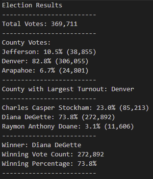

# Election_Analysis

## Overview of Election Audit
A Colorado Board of Elections employee has given me the following tasks to complete the election audot of a recent local congressional election.
1. Calculate the total number of votes cast.
2. Get a complete list of candidates who received votes.
3. Calculate the percentage of votes each candidate won.
4. Determine the winner of the election based on the popular vote.
5. Determine total vote count and percentage of votes in the election from each county.
6. Determine which county had the largest voter turnout.

## Resources
- Data Source: election_results.csv
- Software: Python 3.8.8, Visual Studio Code, 1.57

## Election-Audit Summary
The analysis of the election show that:
- There were 369,711 total votes cast.

Voters and Percentage by County:
-  Jefferson: 10.5% (38,855 voters)
-  Denver: 82.8% (306,055 voters)
-  Arapahoe: 6.7% (24.801 voters)

The candidates were:
- Charles Casper Stockham
- Diana DeGette
- Raymon Anthony Doane

The candidate results were:
- Charles Casper Stockham: 23% (85,213 votes)
- Diana DeGette: 73.8% (272,892 votes)
- Raymon Anthony Doane: 3.1% (11,606 votes)

The winner of the election was:
- Diana DeGette with 272,892 total votes and 73.8% of the votes.

## Challenge Overview

## Challenge Summary
